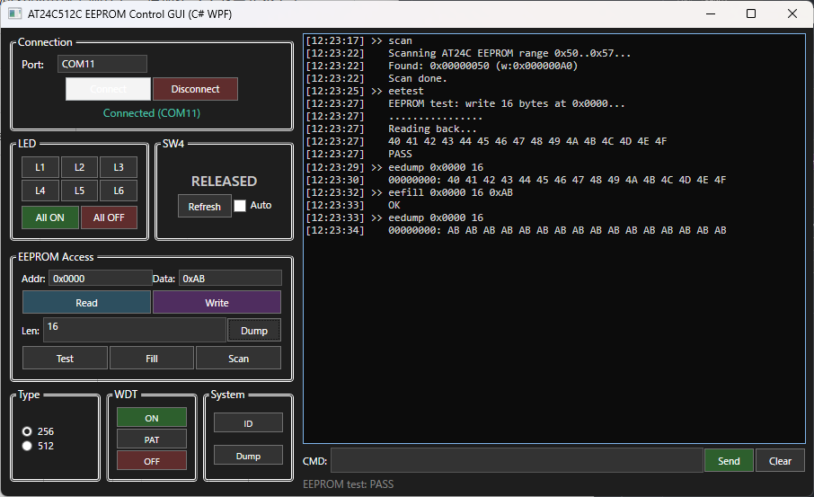

# T20 Sapphire SoC AT24C512C I2C EEPROM

[](https://github.com/Q4nOSp4SPVzW/at24c512c_t20/actions/workflows/firmware.yml)
[](https://github.com/Q4nOSp4SPVzW/at24c512c_t20/actions/workflows/scripts.yml)

Trion T20 BGA256 開発ボード向けの Sapphire SoC RV32 プロジェクトです。
Sapphire SoC の I2C ペリフェラルで AT24C512C/AT24C256 I2C EEPROM を制御します。

## プロジェクトの特徴

EEPROM制御を主目的としつつ、組み込み開発の基本要素を一通り網羅した学習素材としての側面も持っています:

| 要素 | 実装 |
|---|---|
| **UART** | コマンドモニタ・文字列入出力・タイムアウト処理 |
| **I2C** | マスタ通信・バススキャン・EEPROM R/W |
| **GPIO** | LED制御・SW入力・デバウンス(RTL) |
| **WDT** | 有効化・ハートビート・ハングアップ検出 |
| **MMIO** | レジスタ読み書き・FW仮想レジスタ |
| **割込み** | PLIC接続 (FWはポーリング方式) |
| **タイマ** | CLINT・ソフトウェア遅延 |
| **メモリ** | リンカスクリプト・スタック・BSSクリア |
| **RTL** | クロック・リセット・デバウンス・AXIダミー応答 |

加えて、ファームウェアビルド → FPGAビルド → 書き込み → テストの**開発フロー全体**がPowerShellスクリプトで自動化されており、GitHub ActionsでCIも回る構成になっています。組み込みRISC-V + FPGAの学習素材としてよくできたプロジェクトです。

## バージョン

- ファームウェア: `v1.0.0`
- 日付: `2026-06-18`
- FW仮想レジスタベースアドレス: `0xF80FF000`

## Sapphire SoC 構成

Efinity Sapphire SoC IP (v3.4.0) を使用。Efinity IP Manager で生成した `ip/soc/` 配下の設定に基づく。

### CPU コア

| 項目 | 設定 |
|------|------|
| アーキテクチャ | RISC-V RV32IM (Zicsr + Zifencei) |
| 圧縮命令 (C) / アトミック (A) / 浮動小数点 (F/D) | 無効 |
| MMU / Supervisor / Custom Instruction / Barrel Shifter | 無効 |
| MUL/DIV 高速拡張 | 無効 |
| CSR 構成 | Reduced CSR |
| コア数 / 動作周波数 | 1 / 100 MHz (50MHz オシレータ → PLL → 100MHz) |
| デバッグ | RISC-V Debug (ハードブレークポイント 0) |

### キャッシュ

| 項目 | 設定 |
|------|------|
| I-Cache | 4KB / 1way / 64B per line |
| D-Cache | 4KB / 1way / 64B per line |

### メモリマップ

| 種別 | ベースアドレス | サイズ | 備考 |
|------|---------------|--------|------|
| 内蔵RAM (RAM_A) | `0xF9000000` | 16KB | ファームウェア + スタック |
| AXI Slave | `0x01000000` | 16MB | RTLでダミー応答 (未使用) |
| ペリフェラル空間 | `0xF8000000` | 16MB | 下記ペリフェラルを配置 |
| CLINT | `0xF8B00000` | 64KB | タイマ・割り込み |
| PLIC | `0xF8C00000` | 4MB | 外部割り込みコントローラ |

### ペリフェラル

| ペリフェラル | 有効 | ベースアドレス | サイズ | 詳細 |
|--------------|:----:|---------------|--------|------|
| UART0 | ✅ | `0xF8010000` | 64B | TX/RX FIFO 128, 9600bps 8N1 (FW設定) |
| SPI0 | ✅ | `0xF8014000` | 4KB | Cmd/Rsp FIFO 256, 8bit, SS 1 (未使用) |
| I2C0 | ✅ | `0xF8016000` | 256B | 100kHz Standard Mode, EEPROM 接続 |
| GPIO0 | ✅ | `0xF8015000` | 256B | 8bit, LED[6:0] 出力 / SW4 入力 |
| Watchdog (WDT0) | ✅ | `0xF8017000` | 256B | prescaler 24bit, timeout 16bit, 2 counters |
| APB Slave0 | ✅ | `0xF8100000` | 64KB | 未使用 (RTLでダミー) |

> UART1/2, SPI1/2, I2C1/2, GPIO1, Timer0/1/2 は無効。

### 割り込み

| 割り込み | ID | 有効 | 接続先 |
|----------|:--:|:----:|--------|
| UART0 | 1 | ✅ | PLIC |
| SPI0 | 4 | ✅ | PLIC (未使用) |
| I2C0 | 8 | ✅ | PLIC |
| GPIO0 (bit0/bit1) | 12/13 | ✅ | PLIC |
| Watchdog | 32 | ✅ | PLIC (panic) |
| USER_0 (外部) | 16 | ✅ | RTLで `1'b0` 固定 |

> ファームウェアはポーリング方式で動作し、PLIC割り込みは未使用です。

### RTL トップ接続

```
                clk_100m (PLL出力)
                    │
        ┌───────────┴───────────┐
        │   Sapphire SoC (soc)  │
        │                       │
   UART │ ◄──── uart_rx_i (C3)  │
        │ ────► uart_tx_o (D3)  │
        │                       │
    I2C │ ◄──► i2c_scl_io (B1) │ ──► EEPROM SCL
        │ ◄──► i2c_sda_io (B2) │ ──► EEPROM SDA
        │                       │
   GPIO │ ◄──── sw4_i (P2)      │
        │ ────► led_o[7:0]      │ ──► ユーザーLED
        │                       │
   AXI  │ ────► (ダミー応答)    │
        │                       │
        └───────────────────────┘
```

- I2C SCL/SDA はオープンドレン双方向 (RTLで `1'bz` / `1'b0` 切替)
- LED[7] はFabric回路で独立点滅 (CPUクラッシュ時も継続)
- AXI Master はRTLでダミー応答 (FPGA内未接続の周辺アクセス用)

### LED の動作

ユーザーLED 8個は3つの源に分かれています:

| LED | 駆動元 | 動作 |
|-----|--------|------|
| LED0 | CPU ファームウェア | メインループ内で約0.5秒周期でトグル (CPU生存確認用) |
| LED1〜6 | CPU ファームウェア | UARTコマンド `1`〜`6` / `a` / `c` で制御 |
| LED7 | FPGA Fabric (ハードウェア) | 27bitカウンタで約1.5Hz点滅 (CPUクラッシュ時も継続) |

RTL での接続:

```verilog
assign led_o = {~blink_cnt[25], ~gpio_write[6:0]};
//              ↑LED7=HW点滅     ↑LED6:0=CPU GPIO出力
```

**ハング判別**: LED7が点滅しているのにLED0が止まっている場合、CPUがクラッシュまたはハングアップしています。

### FPGA リソース使用量・タイミング

> 同一のSapphire SoC構成を持つベースプロジェクト (`sapphire_uart_led_t20`) でのビルド結果を参照値として記載。

#### タイミング (Efinity STA, C4 speed grade)

| 項目 | 値 | 判定 |
|------|----|:----:|
| 制約クロック | `clk_100m` 10.000ns (100MHz) | - |
| Setup Slack | +0.681 ns | ✅ |
| Hold Slack | +0.086 ns | ✅ |
| 達成最高周波数 | 107.3 MHz (9.319ns) | ✅ |
| クリティカルパス | CPUコア内 `memory_to_writeBack` → `mult` (6ロジックレベル) | - |

#### リソース使用量 (T20F256)

| リソース | 使用数 | 総数 | 使用率 |
|----------|--------|------|--------|
| Logic Elements (LE) | 6,308 | 19,728 | 31.97% |
| Memory Blocks | 43 | 204 | 21.08% |
| Multipliers (DSP) | 4 | 36 | 11.11% |
| 入力ピン / 出力ピン / クロック | 3 / 9 / 1 | - | - |

T20F256 (19,728 LE) に対して **約32%** を消費。残り約68%をユーザー回路に使用可能。SoC本体 (CPUコア・キャッシュ・ペリフェラル・内蔵RAM) が大部分を占め、ユーザー回路 (LED点滅・SW4デバウンス・AXIダミー) はLE約50以下。

> RAM内訳: 内蔵RAM 32ブロック (16KB) / D-Cache 10 / I-Cache 9 / レジスタファイル 4 / SPI0 FIFO 2 / UART0 FIFO 2 = 計59ブロック (T20F256 全204ブロック中 28.92%)。残り145ブロック (約72KB) をユーザー回路のBRAMに使用可能。

## ボード配線

| 信号 | ピン | GPIO | 説明 |
|------|------|------|------|
| UART RX / TX | C3 / D3 | GPIOL_48/46 | UART 受信/送信 |
| I2C SCL / SDA | B1 / B2 | GPIOL_44/45 | I2C クロック/データ (オープンドレン) |
| SW4 | P2 | GPIOL_02 | ユーザースイッチ |
| LED[7:0] | - | GPIOR_* | ユーザーLED (アクティブLow) |
| クロック | L13 | GPIOR_157 | 50MHz → PLL → 100MHz |

### EEPROM 接続

T20 ボードの I/O ヘッダ (B1, B2 ピン) から EEPROM ボードへ配線:

```
T20 ボード              EEPROM ボード
---------              -------------
B1 (SCL) ──────────── SCL
B2 (SDA) ──────────── SDA
3.3V     ──────────── VCC
GND      ──────────── GND
```

- SCL/SDA ラインには 4.7kΩ のプルアップ抵抗が必要
- A2,A1,A0 ピンは GND に接続 (スレーブアドレス 0xA0)
- WP ピンは GND に接続 (書き込み許可)

## UART設定

- ボードのUSBシリアルポート (OSで割り当てられたCOM番号)
- 9600 bps, 8bit, parity なし, stop 1

## UARTコマンド

電源オンまたはプログラム直後にバナーが表示されます:

```
AT24C512C I2C EEPROM v1.0.0 2026-06-18
```

### EEPROM コマンド

#### `eew <addr16> <data>` — 1バイト書き込み

指定アドレスに1バイトを書き込みます (書き込み完了に5ms)。

```
> eew 0x1000 0xAB
OK
```

#### `eer <addr16>` — 1バイト読み取り

```
> eer 0x1000
0x00001000 = 0x000000AB
```

#### `eedump <addr16> <len>` — 複数バイトダンプ

指定アドレスから `len` バイト (最大64) を16バイト/行でダンプします。`len` 省略時は16。

```
> eedump 0x0000 32
00000000: 40 41 42 43 44 45 46 47 48 49 4A 4B 4C 4D 4E 4F
00000010: 00 00 00 00 00 00 00 00 00 00 00 00 00 00 00 00
```

#### `eefill <addr16> <len> <data>` — 一括書き込み

指定アドレスから `len` バイト (最大128) を同じ値で埋めます (ページ書き込み)。

```
> eefill 0x2000 16 0xFF
OK
```

#### `eetest` — テストパターン書き込み＆検証

アドレス 0x0000 に 0x40〜0x4F の16バイト連番を書き込み、読み返して一致を確認します。

```
> eetest
EEPROM test: write 16 bytes at 0x0000...
................
Reading back...
40 41 42 43 44 45 46 47 48 49 4A 4B 4C 4D 4E 4F
PASS
```

#### `memtest` — EEPROM メモリテスト

データ・アドレス・パターン整合性を検証します:

| 書式 | 内容 | 所要時間 |
|------|------|---------|
| `memtest` / `memtest quick` | クイックテスト (4アドレス×4パターン) | ~0.1秒 |
| `memtest page <addr16>` | 1ページ×4パターン | ~3秒 |
| `memtest range <addr16> <len>` | 指定範囲(最大1024B)のアドレス依存テスト | len×5ms |
| `memtest full` | 全領域×3パターン | ~10秒 |

> ページサイズは `eetype` で選択中のEEPROMタイプに依存します (AT24C256: 64B, AT24C512C: 128B)。
>
> **注意:** `full` はEEPROMの書き換え寿命(100万回/セル)を消費します。頻繁な実行は避けてください。

```
> memtest
Quick test: 4 addresses x 4 patterns...
  [0x00000000] OK
  [0x00004000] OK
  [0x00008000] OK
  [0x0000C000] OK
Quick test PASS
```

#### `nvm` — 不揮発性保持テスト

電源を切ってもデータが残るかを確認するテストです。EEPROM末尾にマジック・カウンタ・チェックサムを書き込み、電源サイクル後の保持を検証します。

| サブコマンド | 内容 |
|--------------|------|
| `nvm save` | 初期パターン書き込み (magic=0xA5, counter=0) |
| `nvm load` | 読み出して magic・counter・checksum を表示・検証 |
| `nvm inc` | counter を +1 して保存 |
| `nvm clear` | テスト領域を 0x00 でクリア |

レイアウト (4バイト、`base = eeprom_max_addr - 15`):

```
(base+0): Magic (0xA5)  /  (base+1): Counter (16bit BE)  /  (base+3): Checksum (Magic ^ Counter)
```

> `base` は `eetype` に依存 (AT24C256: 0x7FF0, AT24C512C: 0xFFF0)

テスト手順: `nvm save` → 電源OFF/ON → `nvm load` (Status=OK で保持確認) → `nvm inc` → 電源OFF/ON → `nvm load` (Counterが増えていればOK)。

```
> nvm save
Saving NVM pattern...
OK

> nvm load
Loading NVM pattern...
  Magic    = 0x000000A5
  Counter  = 0x00000001
  Checksum = 0x000000A4
  Status   = OK
Retention OK.
```

`Status = INVALID` (magic不一致) / `CORRUPT` (checksum不一致) はデータ破損を示します。

#### `scan` — I2C バススキャン

アドレス 0x03〜0x77 を走査し、ACKを返すデバイスを一覧します。各アドレスを **2回試行** し、両方ともACKの場合のみ報告します (フェイクACKの排除)。

```
> scan
Scanning I2C bus 0x03..0x77...
Found: 0x00000050 (w:0x000000A0)
Scan done.
```

> **トラブルシュート:**
> - 何も見つからない場合: 配線・プルアップ抵抗・電圧を確認。
> - 1個のEEPROMで複数アドレス検出: チップのアドレスプレフィックス方式の違いの可能性。例えば 0x50 と 0x58 の両方が見つかる場合、1Mbit(128KB) EEPROM (M24M01/CAT24M01系) で A16 をデバイスアドレスbitに押し込む方式の可能性があります。AT24C256 (32KB) / AT24C512C (64KB) は `1010xxx` (0x50〜0x57) のみ応答する仕様です。

#### `iinit` — I2C コントローラ再初期化

I2Cペリフェラルの設定を再適用します。バスがスタックした場合の回復に使用します。

### LED/GPIO コマンド

| コマンド | 内容 |
|----------|------|
| `1`〜`6` | LED1〜LED6 を個別トグル (アクティブLow、押すごとに点灯/消灯切替) |
| `a` | LED1〜LED6 をすべて点灯 |
| `c` | LED1〜LED6 をすべて消灯 |
| `s` | SW4 状態読み取り (1=押下, 0=未押下) |
| `g` | GPIO レジスタダンプ |

```
> 1
OK         # LED1 トグル

> a
OK         # 全点灯

> s
0          # SW4 未押下

> g
GPIO_IN = 0x00000000
GPIO_OUT= 0x00000001
GPIO_OE = 0x0000007F
```

### 情報・ステータスコマンド

#### `id` / `dump` — ファームウェア情報

`id` はバージョン・日付・レジスタ配置・EEPROMタイプを表示します。`dump` は `id` + GPIO + UART/WDT 状態をまとめて表示します。

```
> id
ID INFO
FW      = v1.0.0 AT24C512C
DATE    = 2026-06-18
ID      = 0x41543235
VERSION = 0x00010000
DATEHEX = 0x20260618
FW_BASE = 0xF80FF000
I2C_REG = 0xF8016000
I2CINIT = 0x00000001
EE TYPE = AT24C512C 64KB
```

#### `err?` — 直前のエラー

```
> err?
LASTERR = 0x00000000
```

エラー一覧:

| コード | 意味 |
|--------|------|
| `0x0` | エラーなし |
| `0x1` | 不明なコマンド |
| `0x2` | 引数エラー |
| `0x3` | 読み取り専用 |
| `0x4` | コマンド行が長すぎる |
| `0x5` | I2C NACK / 通信失敗 |
| `0x6` | アドレス範囲外 |

#### `help` — コマンド一覧

```
> help
=== EEPROM ===
eew <addr16> <data>  write byte
eer <addr16>          read byte
eedump <addr16> <len> dump (max 64)
eefill <addr16> <len> <data> fill (max 128)
eetest                test pattern
memtest [quick|page <a>|range <a> <l>|full]
nvm save|load|inc|clear   retention test
scan                  I2C bus scan
iinit                 reinit I2C
eetype 256|512        select EEPROM type
=== LED/GPIO ===
1-6 a c s g           LED/SW4 control
=== Misc ===
id dump err? help     info/status
wdt on/off/pat/hang   watchdog
m <addr>              read32
w <addr> <data>       write32
```

### デバッグコマンド

#### `m <addr>` / `w <addr> <data>` — 32ビット MMIO 読み取り/書き込み

メモリマップドレジスタを32ビット単位で読み取り/書き込みします。

```
> m 0xF8016000
F8016000 = 00000000

> w 0xF8015000 0x7F
OK
```

FW仮想レジスタ (`0xF80FF000`〜) は固定値を返し、書き込みは `ERR 3` (読み取り専用) になります:

```
> m 0xF80FF000
F80FF000 = 41543235
```

#### `wdt on|off|pat|hang` — ウォッチドッグ制御

| サブコマンド | 内容 |
|--------------|------|
| `on` | WDT 有効化 (タイムアウト3秒) |
| `off` | WDT 無効化 |
| `pat` | ハートビート送信 |
| `hang` | ハートビート停止 (3秒後にリセット) |

```
> wdt on
OK

> wdt hang
WDT heartbeat stopped; reset expected in ~3s
```

## EEPROMタイプ切替 (`eetype`)

実行時にEEPROMタイプを切り替え可能です。デフォルトは AT24C512C。

| コマンド | EEPROM | 容量 | ページサイズ | 最大アドレス |
|----------|--------|------|:----------:|:----------:|
| `eetype 256` | AT24C256 | 32KB | 64B | 0x7FFF |
| `eetype 512` | AT24C512C | 64KB | 128B | 0xFFFF |

```
> eetype 256
EEPROM: AT24C256 32KB page=64

> eetype 512
EEPROM: AT24C512C 64KB page=128
```

現在のEEPROMタイプは `id` コマンドの `EE TYPE` 行で確認できます。

## ファームウェア仮想レジスタ

`0xF80FF000`〜 はソフトウェア実装の仮想レジスタです (`m`/`w` コマンドでアクセス可、書き込みは読み取り専用エラー)。実バスには出力されません。

| アドレス | 内容 | 値 |
|----------|------|----|
| `0xF80FF000` | ID (`"AT25"`) | `0x41543235` |
| `0xF80FF004` | バージョン | `0x00010000` |
| `0xF80FF008` | 日付 | `0x20260618` |
| `0xF80FF00C` | 直前のエラー | `last_error` |

## I2C 設定

- 周波数: 100kHz (Standard Mode)
- スレーブアドレス: 0xA0 (7-bit: 0x50, A2A1A0=000)
- アドレス幅: 16-bit
- ライトサイクルタイム: 5ms

## テストバッチ (test.ps1)

`test.ps1` は全コマンドを自動テストするスクリプトです。ファームウェア書き込み後の動作確認に使用します。

### 使用法

```powershell
.\test.ps1 -Port COM11
```

### テスト内容 (35項目)

| グループ | テスト数 | 内容 |
|---|---|---|
| 情報表示 | 4 | `err?` `id` `dump` `help` |
| EEPROMタイプ | 1 | `eetype 256` |
| 読み書き | 4 | `eew` `eer` `eefill` `eedump` |
| テストパターン | 2 | `eetest` `eedump`(確認) |
| memtest | 3 | `memtest quick` `page` `range` |
| NVM保持 | 5 | `nvm save` `load` `inc` `load` `clear` |
| I2Cバス | 2 | `iinit` `scan` |
| LED/GPIO | 2 | LED目視確認 / `g` |
| ウォッチドッグ | 3 | `wdt on` `pat` `off` |
| MMIO | 2 | `m`(FW仮想レジスタ) |
| エラー処理 | 3 | `eetype`(無引数) `eetype 999` `unknowncmd` |
| 64KBモード | 2 | `eetype 512` `memtest quick` |
| 後片付け | 1 | `eetype 256` |

### インタラクティブテスト

以下のテストはユーザー操作が必要です:

- **SW4状態変化検出**: 「SW4 を押してください」→自動検出→「SW4 を離してください」→自動検出 (30秒以内)
- **LED目視確認**: LED1〜6を順に点灯→各LEDを目視確認 `[y/n]`→全点灯/全消灯確認

## 必要な環境

| ソフトウェア | バージョン | インストール先（固定） |
|---|---|---|
| [Efinity IDE](https://www.efinixinc.com/support/efinity.php) | 2026.1 | `C:\Efinity\2026.1\` |
| Efinity RISC-V IDE (ツールチェーン) | 2026.1 | `C:\Efinity\efinity-riscv-ide-2026.1\` |

> **注意:** `build_sw.ps1` のツールチェーンパスが上記パスにハードコードされています。

## ビルドと書き込み手順

```powershell
.\build_sw.ps1   # ファームウェアのビルドとROMバイナリ配備
.\build.ps1      # Efinity FPGAビルド（合成・配置配線）
.\program.ps1    # FPGAへ書き込み
.\test.ps1       # 全コマンド動作テスト (オプション: -Port COMxx)
.\gui.ps1        # GUIコントロールパネル (オプション: -DefaultPort COMxx)
```

## GUIコントロールパネル



WPFベースのGUIダッシュボードから全機能を操作できます。COMポート接続、LED操作、SW4状態表示、EEPROM読み書き、WDT、システム情報表示、生コマンド送信を1画面で扱えます。

配布用にはC# WPF版EXEを推奨します。PowerShell版も同じ操作体系で利用できます。

### 使用法

```powershell
.\dist\AT24C512C_GUI_CSharp.exe  # C# WPF版 (推奨)
.\dist\AT24C512C_GUI.exe         # PowerShell WPF版をEXE化したもの
.\gui.ps1                       # PowerShellスクリプト版 (デフォルト COM11)
.\gui.ps1 -DefaultPort COM5     # ポート指定
```

C# WPF版を再ビルドする場合:

```powershell
.\build_csharp_wpf.ps1
```

### 機能

| パネル | 機能 |
|---|---|
| **Connection** | COMポート選択・Connect/Disconnect |
| **LED Control** | LED1〜6 個別トグル / 全点灯 / 全消灯 |
| **SW4 Status** | リアルタイム状態表示 (Refresh / Auto ポーリング) |
| **EEPROM Access** | 1バイト読み書き / ダンプ / フィル / eetest / I2Cスキャン |
| **EEPROM Type** | AT24C256(32KB) / AT24C512C(64KB) 切替 |
| **Watchdog** | WDT 有効化 / ハートビート / 無効化 |
| **System** | id / dump 表示 |
| **ログエリア** | 全コマンド・応答を時刻付きで記録 |
| **生コマンド入力** | 任意コマンド送信 (Enter or Send) |

> **重要: SoC IP の再生成が必要**
>
> 内蔵RAMを8KB→16KBに変更しているため、初回ビルド前にEfinity IDEでSapphire SoC IPを再生成する必要があります:
> 1. Efinity IDEでプロジェクトを開く
> 2. IP Manager で `soc` IPを開く
> 3. `OCRSize` が `16384` になっていることを確認 (settings.jsonは更新済み)
> 4. 「Generate」ボタンでIPを再生成
> 5. `ip/soc/soc.v` と `embedded_sw/` が自動更新される
> 6. その後 `build_sw.ps1` → `build.ps1` → `program.ps1` の順に実行

## CI (GitHub Actions)

push / PR 時に以下のCIが自動実行されます:

| ワークフロー | トリガー | 内容 |
|---|---|---|
| [Firmware Build](https://github.com/Q4nOSp4SPVzW/at24c512c_t20/actions/workflows/firmware.yml) | `sw/`, `embedded_sw/` 変更時 | RISC-V GCC でファームウェアをビルドし、ELF/BIN/MAPをartifact生成 |
| [Script Validation](https://github.com/Q4nOSp4SPVzW/at24c512c_t20/actions/workflows/scripts.yml) | `*.ps1` 変更時 | PowerShellスクリプトの構文チェック (test/gui/build_sw/build/program.ps1) |

> FPGAビルド (Efinity) はライセンスが必要なためCI対象外。実機テスト (test.ps1) はハードウェア接続が必要なためCI対象外。
